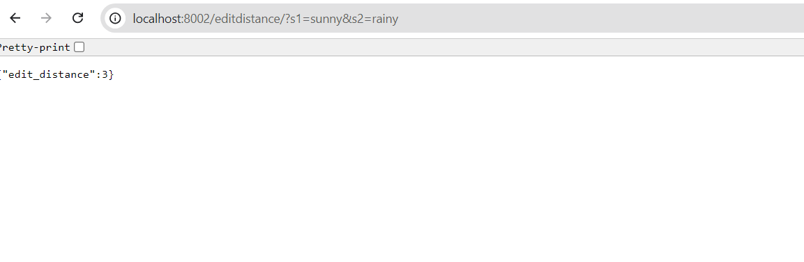

# Mono Repo with Multiple Microservices

## Services

- **Poetry Service:** FastAPI application running on port 8001
- **Sample Service 2:** FastAPI application running on port 8002 for calculating edit distance.

## Setup Instructions

### Setting Up the Environment

Each service has its own dependencies and lockfile, and should be worked on in a separate virtual environment.

### Install Dependencies for `poetry_service`

1. **Navigate to the service directory:**
   ```bash
   cd services/poetry_service
    ```
2. **Install dependencies:**
    ```bash
    poetry install
    ```

## Install Dependencies for sample-service-2
    
1. **Navigate to the service directory:**

```bash
    cd services/sample-service-2
```
2. **Install dependencies:**

```bash
poetry install
```

## Running the Services Locally

1. **Start Docker Compose:**

    1. **Using Script:**
        ```bash
            chmod +x runserver.sh
            ./runserver.sh
        ```
    2. **Manually:**
        ```bash
            docker-compose up --build
        ```

2. **Access the services:**

- `poetry_service`: http://localhost:8001
- `sample-service-2`: http://localhost:8002/editdistance?s1=text1&s2=text2

## Development
- Changes to the code will automatically reload the services.

## Using Separate Virtual Environments
To avoid dependency clashes, you can create separate virtual environments for each service manually:

1. **Create a virtual environment:**

    ```bash
    python -m venv .venv
    ```

2. **Activate the virtual environment:**

    - On Linux/macOS:
    ```bash
    source .venv/bin/activate
    ```
    - On Windows:
    ```bash
    .venv\Scripts\activate
    ```

3. **Install dependencies in the activated virtual environment:**

    ```bash
    poetry install
    ```

## Samples

1. ***Edit Distance***

    

This setup ensures that `poetry_service` and `sample-service-2` are isolated, with separate dependencies managed by `Poetry`, and avoids dependency clashes by working within separate virtual environments.
